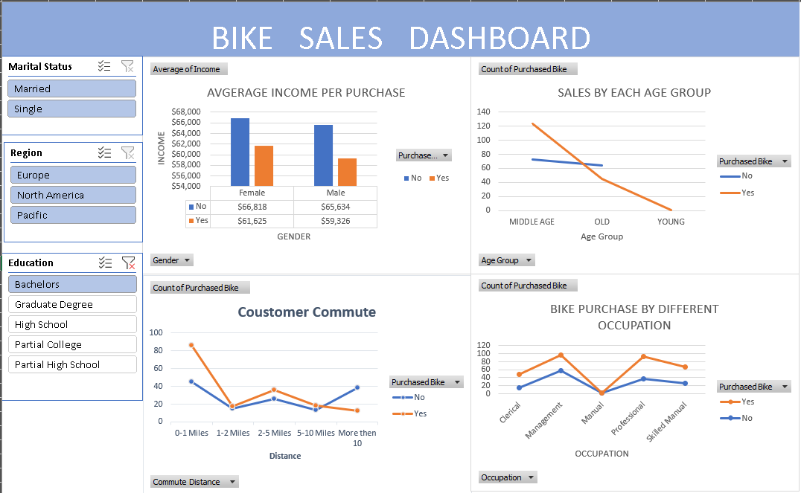

# Bike Buyers Data Analysis & Interactive Excel Dashboard

An end-to-end data analysis project in Microsoft Excel analyzing customer demographics, commute distances, and socioeconomic factors that influence bike purchases across 1,000+ customer records.

---

## 📊 Dashboard Preview

---

## 📌 Project Overview

The objective of this project was to analyze raw customer sales data to identify key patterns and drivers behind bike purchases. 

The workflow covered the entire data analytics lifecycle:
1. **Raw Data Preservation:** Kept the original dataset untouched in `bike_buyers` for data integrity.
2. **Data Cleaning & Preparation:** Created a dedicated working sheet (`Worksheet`) to remove duplicate rows, clean blank fields, and create age demographic bins.
3. **PivotTable Aggregation:** Structured multiple summary tables to compare purchases across commute distance, income brackets, age groups, and occupations.
4. **Interactive Dashboard:** Built PivotCharts and linked dynamic slicers to allow interactive filtering by marital status, region, and education.

---

## 🔍 Key Insights

* **Commute Distance Matters:** Customers commuting **0–1 miles** have the highest purchase rate (86 buyers), while conversion drops significantly for long-distance commuters (10+ miles).
* **Core Age Segment:** **Middle-aged adults** represent the vast majority of buyers (123 purchases) compared to older and younger demographics.
* **Income Comparison:** Active bike buyers averaged around $60,400, while non-buyers had slightly higher average reported incomes ($66,200).
* **Occupational Demand:** **Professionals** and **Management** constitute the highest customer volume, with Professionals leading in total bike purchases.

---

## 🛠️ Excel Skills Demonstrated

* **Data Management:** Data cleaning, duplicate removal, column standardization, and workflow separation (Raw vs. Working data).
* **Data Transformation:** Categorical binning (Age brackets) and calculated summaries.
* **PivotTables & Analytics:** Multi-variable aggregations, cross-tabulations, and summary metrics.
* **Data Visualization:** Clustered column charts, line graphs, dashboard layout, and interactive slicers.

---

## 📁 Repository Structure

* `Bike_Sales_Analysis.xlsx` — Complete Excel workbook containing raw data, cleaning steps, PivotTables, and the final interactive dashboard.
* `dashboard.png` — High-resolution screenshot of the dashboard interface.
